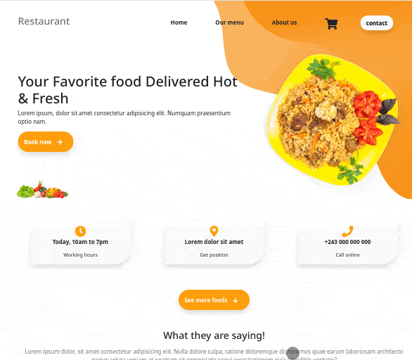

<p align="center">
    <h1 align="center"> Restaurant </h1>
</p>

<p align="center">
    <h2 align="center"> 
    This project comes after the introduction of the ES6 class keyword, ES6 modules, and webpack.</h2>
</p>

<p align="center">
    <a href="https://img.shields.io/badge/Microverse-blueviolet" alt="Contributors">
        </a>
    <a href="https://www.javascript.com/" alt="JS">
        </a>
    <a href="https://webpack.js.org//" alt="Webpack">
        </a>
    <a href="https://babeljs.io/" alt="Babel">
        </a>
    <a href="https://eslint.org/" alt="Eslint">
        </a>
    <a href="https://stylelint.io/" alt="Stylelint">
        </a>
</p>

<p align="center">    
    <br />
    <a href="https://github.com/guillainbisimwa/restaurant"><strong>Explore this project »</strong></a>
    <br />
    <br />&#10023;
    <a href="#Prerequisites">Watch the Live Version</a> &#10023;
    <a href="#Prerequisites">Prerequisites</a> &#10023;
    <a href="#Getting-Started">Getting Started</a> &#10023;
    <a href="#Usage">Usage</a> &#10023;
    <a href="#Contributing">Contributing</a> &#10023;
    <a href="#Author">Author</a> &#10023;
    <a href="#Show-your-support">Show your support</a> &#10023;
    <a href="#License">License</a> &#10023;
    <a href="#Acknowledgments">Acknowledgments</a> &#10023;
    <a href="https://github.com/guillainbisimwa/restaurant/issues">Report Bug</a>&#10023;

</p>

<br/>

<b>Restaurant </b> The main goal of this project is to understand the benefits of modularized code as well as the ability to set up a javascript application made of different modules using webpack.



## Watch the Live Version

[Restaurant](http://gbisimwa.me/restaurant/)

### Prerequisites

- JavaScript ES6
- Text Editor
- Git
- NodeJS
- Webpack
- A Bootstrap 5

## Getting Started

1. Open Terminal.
2. Navigate to your desired location to download the contents of this repository.
3. Copy and paste the following code into the Terminal :
   `git clone https://github.com/guillainbisimwa/restaurant.git`
4. Run `cd restaurant`
5. Install the needed dependencies `npm install`
6. run `npm run build` to bundle scripts with **_webpack_** a static module bundler for modern JavaScript applications

### Usage

To watch the local version of this project check on your browser for the link :

```
restaurant/dist/index.html
```

## Contributing

This project was created for educational purposes as part of the Microverse web development curriculum; contributing is not accepted.

Feel free to check the [issues page](https://github.com/guillainbisimwa/restaurant/issues).

## Author

👤 **Guillain Bisimwa**

- Github : [@guillainbisimwa](https://github.com/guillainbisimwa)
- Twitter : [@gullain_bisimwa](https://twitter.com/gullain_bisimwa)
- Linkedin : [guillain-bisimwa](https://www.linkedin.com/in/guillain-bisimwa-8a8b7a7b/)

### Show your support

Give a ⭐️ if you like this project!

## License

This project is licensed under the MIT License

## Acknowledgments

- [Design idea by Shakib on Behance](https://dribbble.com/shots/11246595-Foodie-Landing-Page/attachments/2854467?mode=media)
- [Creative Commons ](https://creativecommons.org/licenses/by-nc/4.0/)
